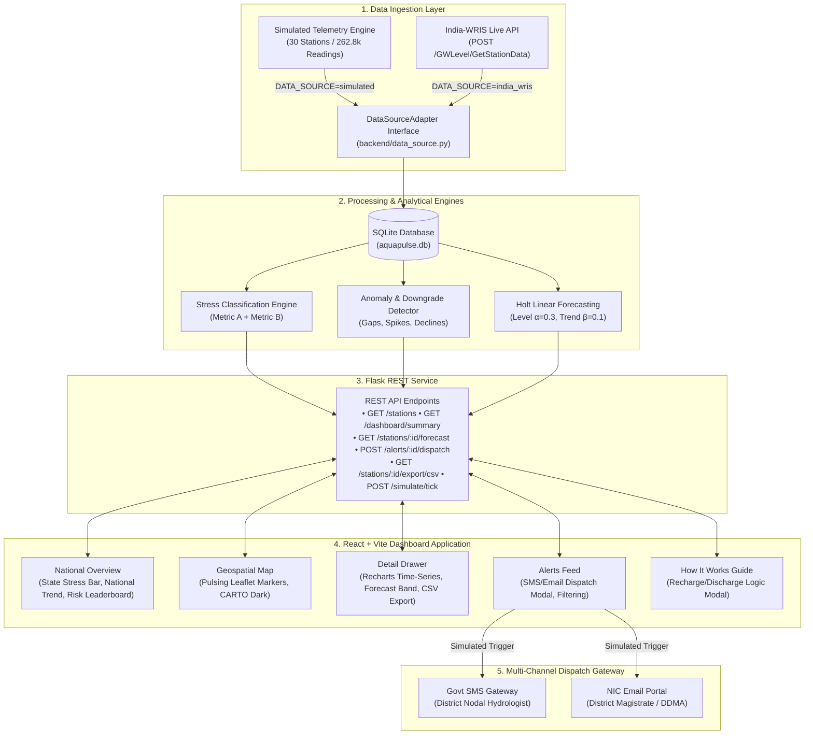

# 💧 AquaPulse — Real-Time Groundwater Resource Evaluation Platform

> **Hackathon Submission for India's Ministry of Jal Shakti & Central Ground Water Board (CGWB)**  
> *Transforming Digital Water Level Recorder (DWLR) Telemetry into Live Actionable Groundwater Intelligence.*

[](https://www.python.org/)
[](https://flask.palletsprojects.com/)
[](https://reactjs.org/)
[](backend/tests/)
[]()

---

## 📌 Problem Statement

Groundwater provides **over 60% of India's irrigated agriculture and 85% of rural drinking water**, but critical aquifers across northwestern, western, and peninsular India face severe depletion. 

Under the **National Hydrology Project (NHP)**, the Central Ground Water Board (CGWB) operates **~15,000+ telemetric Digital Water Level Recorder (DWLR) piezometers** that log groundwater levels hourly and transmit readings wirelessly to the **India-WRIS** (Water Resources Information System) portal.

### The Operational Challenge:
1. **Lagging Assessments**: Conventional dynamic groundwater resource assessments are conducted annually or periodically, leaving acute localized over-extraction unnoticed for months.
2. **Data Noise & Telemetry Gaps**: Field piezometer sensors suffer from telemetry transmission dropouts, electromagnetic spikes, and battery depletion that corrupt automated pipelines.
3. **Lack of Early Warning Dispatch**: District Magistrates and local water authorities lack real-time push alerts when water tables breach critical drawdown thresholds or decline precipitously.

**AquaPulse solves this by providing a unified, real-time evaluation, anomaly detection, forecasting, and emergency dispatch engine that runs continuously on live DWLR streams.**

---

## ⚡ What AquaPulse Does

- 📊 **National & State Executive Dashboard**: A high-level decision screen featuring stacked state stress distributions, 12-month national drying curves, and a composite at-risk station leaderboard.
- 🗺️ **Geospatial Stress Map**: Interactive dark-mode Leaflet map rendering all DWLR stations with dual encoding — **color** for stress classification and **shape** for hydrogeological aquifer type (Alluvial, Hard-rock, Coastal).
- ⚖️ **CGWB-Standard 2-Metric Classification Engine**: Classifies stations into **Safe**, **Semi-Critical**, **Critical**, and **Over-Exploited** by taking the worse of current depth deviation vs. 12-month baseline (Metric A) and 30-day linear decline rate (Metric B).
- 🚨 **Real-Time Anomaly & Downgrade Detector**: Automated triggers for **Sensor Gaps** (>6h missing), **Spikes** (>5m jump), **Sustained Declines** (>0.05 m/day over 7 days), and **Status Downgrades** (Safe $\rightarrow$ Stressed).
- 🔮 **30-Day Holt Linear Exponential Smoothing**: Classical, interpretable trend-and-level forecasting with 95% confidence bands ($\pm 1.96\sigma$) to identify trajectory breaches before they occur.
- 📲 **Automated Multi-Channel Dispatch**: Simulates instantaneous SMS Gateway and NIC Email dispatch to District Nodal Hydrologists, Sub-divisional Magistrates, and DDMA authorities.
- 🔌 **Pluggable India-WRIS Adapter**: Built with the Strategy Pattern — swapping synthetic data for live government API feeds requires zero changes to core evaluation, analytics, or UI code.
- 📥 **CSV Export & In-App Guide**: Instant downloads of 365-day history + 30-day forecast, plus an in-app "How It Works" guide for non-technical evaluation committees.

---

## 🏗️ System Architecture



---

## 🛠️ Technology Stack

| Layer | Technologies Used | Key Libraries & Tools |
|---|---|---|
| **Frontend UI** | React 18, JSX, JavaScript | Vite 8, Leaflet, React-Leaflet, Recharts, Axios |
| **Styling & Theme** | Vanilla CSS (Zero Heavy Frameworks) | CSS Design Tokens, Glassmorphism, Space Grotesk & Inter Typography |
| **Backend Service** | Python 3.8+ (Compatible up to 3.14) | Flask 3.1, Flask-CORS 5.0, SQLite3 |
| **Scientific Computing** | Standard Python Math & Statistics | NumPy, SciPy (Linear Regression, Holt Smoothing) |
| **Testing & QA** | Pytest 8.3 | 33 Unit & Boundary Integration Tests |

---

## 🚀 Quick Start & Installation

### Prerequisites
- **Python**: 3.8 or higher (tested and verified on Python 3.14)
- **Node.js**: 18.x or higher
- **Git**

### 1. Clone & Navigate
```bash
git clone https://github.com/your-username/aquapulse.git
cd aquapulse
```

### 2. Backend Setup
```bash
# Install backend dependencies
pip install flask flask-cors pytest

# Start the Flask API server
# (Database automatically seeds 262,800 readings and runs anomaly detection on first start)
python backend/main.py
```
> API runs on `http://localhost:8000`

### 3. Frontend Setup (in a separate terminal)
```bash
cd frontend
npm install
npm run dev
```
> Open `http://localhost:5173` in your browser.

---

## 🧪 Verification & Automated Tests

AquaPulse includes 33 unit and boundary tests covering the evaluation engine, anomaly detectors, and downgrade triggers:

```bash
# Run test suite
python -m pytest backend/tests/ -v -p no:anyio
```

**Test Output:**
```
============================= test session starts =============================
collected 33 items

backend/tests/test_anomaly.py::TestGapDetection::test_no_gap_no_alert PASSED [  3%]
backend/tests/test_anomaly.py::TestGapDetection::test_short_gap_no_alert PASSED [  6%]
backend/tests/test_anomaly.py::TestGapDetection::test_gap_triggers_alert PASSED [  9%]
backend/tests/test_anomaly.py::TestGapDetection::test_exact_boundary_gap PASSED [ 12%]
backend/tests/test_anomaly.py::TestSpikeDetection::test_normal_readings_no_spike PASSED [ 15%]
backend/tests/test_anomaly.py::TestSpikeDetection::test_spike_triggers_alert PASSED [ 18%]
backend/tests/test_anomaly.py::TestSpikeDetection::test_negative_spike PASSED [ 21%]
backend/tests/test_anomaly.py::TestSpikeDetection::test_just_below_threshold_no_alert PASSED [ 24%]
backend/tests/test_anomaly.py::TestSustainedDeclineDetection::test_flat_series_no_alert PASSED [ 27%]
backend/tests/test_anomaly.py::TestSustainedDeclineDetection::test_steep_decline_triggers_alert PASSED [ 30%]
backend/tests/test_anomaly.py::TestSustainedDeclineDetection::test_mild_decline_no_alert PASSED [ 33%]
backend/tests/test_anomaly.py::TestDowngradeDetection::test_safe_station_no_downgrade PASSED [ 36%]
backend/tests/test_anomaly.py::TestDowngradeDetection::test_critical_level_triggers_downgrade PASSED [ 39%]
backend/tests/test_evaluation.py::TestClassifyByValue::test_safe_level PASSED [ 42%]
... (20 additional evaluation tests)
============================= 33 passed in 0.13s ==============================
```

---

## 🔌 Simulated vs. Production India-WRIS Connectivity

To ensure that this prototype is 100% production-ready for real-world government deployment, we separated data acquisition from analysis using the **Strategy Pattern** in [`backend/data_source.py`](backend/data_source.py).

### Comparison Matrix:

| Component | Prototype (Current) | Production (With India-WRIS API) |
|---|---|---|
| **Data Provider** | `SimulatedDataSource` (Local SQLite) | `IndiaWRISAdapter` (Live CGWB REST API) |
| **Station Coverage** | 30 Representative DWLR Piezometers | 15,000+ Active CGWB Telemetry Stations |
| **Temporal Frequency** | Hourly readings (262,800 seeded) | Live hourly telemetry push/pull |
| **Authentication** | None (Local development) | OAuth2 Bearer Token via India-WRIS IAM |
| **Data Ingestion** | Click `⚡ Simulate Tick` / Background loop | Automatic Webhook / Polling Daemon |
| **Notification Dispatch** | Server & console logging + in-app preview modal | SMS Gateway (C-DAC) + NIC SMTP Relay |

### How to Switch to Live Telemetry in Production:
To connect to live India-WRIS data, simply provide the credentials and set the environment variable:

```bash
DATA_SOURCE=india_wris \
WRIS_BASE_URL="https://indiawris.gov.in/api/2.0" \
WRIS_CLIENT_ID="cgwb_telemetry_client" \
WRIS_CLIENT_SECRET="your_secret_key" \
python backend/main.py
```

### India-WRIS Field Mapping:
```
India-WRIS API Field    →  AquaPulse Internal Schema
────────────────────────────────────────────────────
stationCode             →  station_id
stationName             →  station_name
stateName               →  state
districtName            →  district
latitude / longitude    →  latitude / longitude
wl (Water Level)        →  level_m (m bgl)
status ('S' / 'M')      →  is_flagged (Boolean)
```

---

## 📐 Scientific Methodology & Evaluation Rules

### 1. Two-Metric Stress Classification
AquaPulse adheres to CGWB evaluation guidelines by combining baseline deviation with dynamic velocity:

$$\text{Metric A (Deviation)} = \text{Current Level (m bgl)} - \text{12-Month Rolling Mean (m bgl)}$$
$$\text{Metric B (Decline Rate)} = \frac{d(\text{Level})}{dt} \quad \text{[via Ordinary Least Squares over 30 days]}$$

| Category | Metric A (Deviation) | Metric B (Decline Rate) | Final Classification |
|---|---|---|---|
| 🟢 **Safe** | $\le 2.0\text{ m}$ | $\le 0.010\text{ m/day}$ | $\min(\text{Metric A}, \text{Metric B})$ |
| 🟡 **Semi-Critical** | $2.0 - 5.0\text{ m}$ | $0.010 - 0.030\text{ m/day}$ | Stressed if either metric triggers |
| 🟠 **Critical** | $5.0 - 10.0\text{ m}$ | $0.030 - 0.060\text{ m/day}$ | High risk of localized aquifer depletion |
| 🔴 **Over-Exploited** | $> 10.0\text{ m}$ | $> 0.060\text{ m/day}$ | Severe extraction; drawdown exceeds recharge |

> **Final Stress Level = $\max(\text{Severity}(\text{Metric A}), \text{Severity}(\text{Metric B}))$**

### 2. Holt Linear Exponential Smoothing (30-Day Forecast)
Selected for low compute overhead, interpretability, and robust trend estimation:

$$\text{Level Update:} \quad L_t = \alpha Y_t + (1 - \alpha)(L_{t-1} + T_{t-1})$$
$$\text{Trend Update:} \quad T_t = \beta (L_t - L_{t-1}) + (1 - \beta) T_{t-1}$$
$$\text{Forecast (h steps):} \quad \hat{Y}_{t+h} = L_t + h T_t$$
$$\text{95\% Confidence Band:} \quad \hat{Y}_{t+h} \pm 1.96 \cdot \hat{\sigma} \sqrt{h}$$

*(Hyperparameters: $\alpha = 0.3$, $\beta = 0.1$, training window = 90 daily points).*

---

## 🗺️ Future Roadmap

- 🛰️ **Phase 1: Multi-Source Data Fusion**: Integrate NASA GRACE satellite gravity anomalies and IMD Doppler radar gridded rainfall to separate meteorological drought from anthropogenic over-extraction.
- 🌐 **Phase 2: High-Throughput Stream Ingestion**: Deploy Apache Kafka / MQTT broker architecture capable of ingesting 15,000+ live telemetry packets per second with sub-second anomaly detection.
- 🗺️ **Phase 3: 3D Aquifer Hydrogeological Mapping**: Connect block-level lithology logs to render 3D unconfined and semi-confined aquifer recharge surfaces.
- 📱 **Phase 4: Hyperlocal Alert Distribution**: Direct WhatsApp Business API and automated IVR voice alerts in vernacular languages to Gram Panchayat Sarpanchs and Water User Associations (WUAs).
- 🧠 **Phase 5: Spatio-Temporal Graph Neural Networks**: Advanced graph deep learning models predicting block-level extraction surges during paddy and wheat sowing seasons.

---

## 📄 License & Attribution
Developed for the National Groundwater Innovation Challenge / Ministry of Jal Shakti Hackathon.  
Data structures and hydrogeological parameters inspired by CGWB and India-WRIS published specifications.
